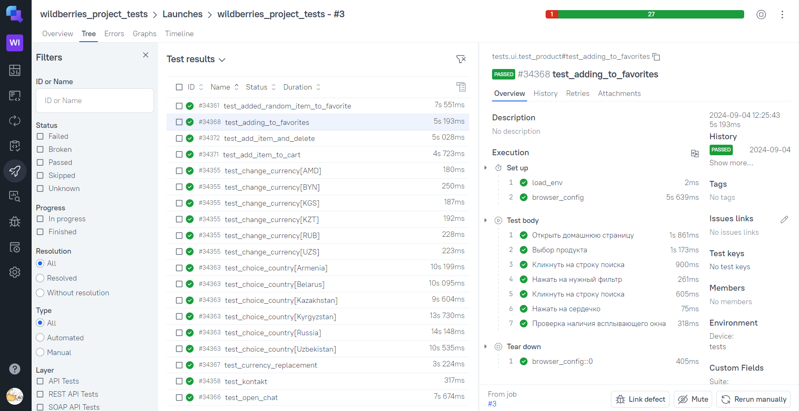

# Проект по тестированию интернет-магазина "https://www.wildberries.ru/"

---
### Список проверок, реализованных в web тестах
1. Открытие чата 'Поддержка Wildberries'.
2. Смена валюты.
3. Поиск товара по артикулу.
4. Поиск товара по фильтру.
5. Добавление товара в избранное.
6. Добавление товара в корзину.
7. Удаление товара из корзины.

---
### Список проверок, реализованных в api тестах
1. Поиск вакансий.
2. Смена валюты.
3. Поиск товара по фильтру.
4. Поиск товара по id.
5. Контакты.
6. Путешествия.
---

### Список проверок, реализованных в mobile тестах
1. Добавление товара в избранное.
2. Поиск товара в каталоге.
3. Выбор страны.
4. Поиск товара по фильтру.
5. Поиск вакансий.
---

### Используемые инструменты
 

 

 
 
 

 

---

### Запуск автотестов осуществляется с использованием Jenkins
> [Ссылка на сборку в Jenkins](https://jenkins.autotests.cloud/job/wildberries_project_tests/)

#### Для запуска автотестов в Jenkins
1. Открыть [задачу в Jenkins](https://jenkins.autotests.cloud/job/wildberries_project_tests/)

2. Нажать "**Build Now**".

---

### Allure отчет

#### Общие результаты

---
#### Результаты прохождения тестов

---
#### Примеры запуска в Allure TestOps

---
#### Список тест кейсов в Allure TestOps

---

#### Интеграция с Jira

---

### Уведомления в Телеграм

---

### Прохождение web теста

---

### Прохождение mobile теста

